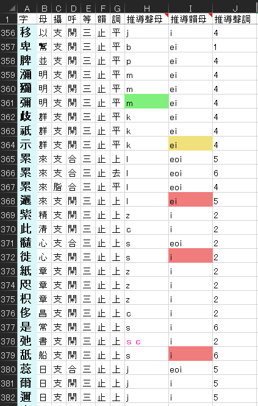

### 一鍵（誤）生成字表  
  
本程序用於從中古音一鍵轉換出字表  
所有數據使用 Excel 表格儲存，以便一般人使用  
轉換出來的字表附有顏色標記，以示可能有出韻等情況，以便做今音字表  
  
  

生成表格示例
  
  
程序用命令行運行，而 CMD 好似會有問題。沒有專用 shell 的，請使用 PowerShell:  
* Ctrl+R -> 輸入「powershell」 ->  輸入「cd {程序所在的目錄}」 -> 「./main.exe {參數}」（參數見下）  
  
*****
  
#### 程序流程  
1. 在同目錄下的泛粵表 `泛粵字表 21.xlsx` 讀取 **聲、韻母演變表** 和 **聲調表**  
2. 在同目錄下的 `廣韻4k.xlsx` 讀取中古地位  
3. jgzw
  
*****

參數可使用 -h 查看詳情（「./main -h」）  
  
#### 命令示例：  
 `main 廣州`  
> 對應泛粵表聲、韻母演變表和聲調表內的廣州列/行，這三張表 **必須** 起碼有地名表頭
  
  
`main 鬱林大塘 -i 泛粵表.xlsx -o "阿薩德法 國紅酒.xlsx" -k 廣韻全字表.xlsx`  
  
`main 陽江 -B`  
> 次濁上歸去時使用參數「-B」  

*****
  
#### 補充說明  
  
**中古表**  
可以自行增刪，衹是要當心，當下附帶表外的其它出韻字都還未標記，要自己人工審查  
格式也要保持一樣，有表頭（首行不轉換）、列序爲「單字」「聲紐」「韻部」「呼」「等」「攝」「聲調」  
但同輸出表的順序不一定一樣，有改動後再覆蓋時要註意  
  
**內置泛粵表**  
僅用於功能測試，所以是閹割版，完整版（未完工）請去谷歌表下載，再覆蓋來  
裏頭兩張演變表隨便改，不過一定要保持格式  
聲母縮寫格式「AB系CD組EFG」等同於『「A系或B系」或「C組或D組」或「E或F或G」』  
  
**聲調部分**  
程序可以自動識別上下陰陽入，祗要填好聲調表就得，然而長短元音唔知會冇辨別出錯，到時再講  
推導聲調有非常多例外，要細審  
  